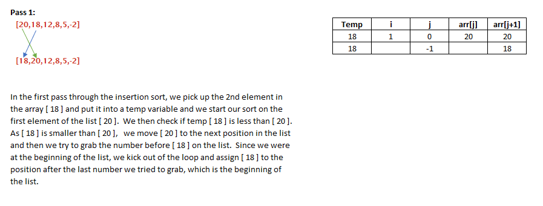
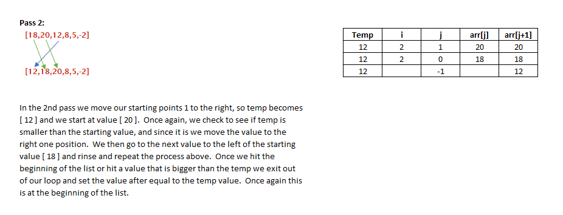
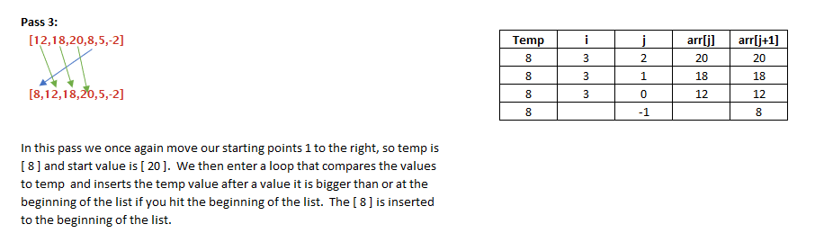
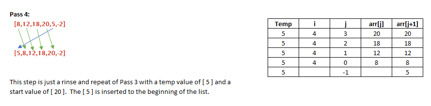
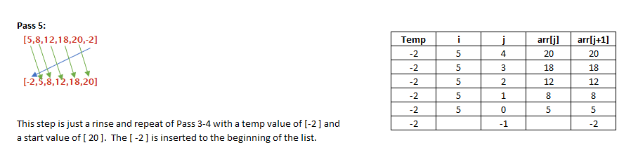
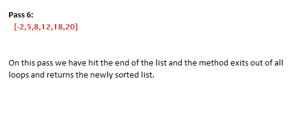

# Table of Content

# C#
## Data Structures
* [Linked List](#Linked-List)
* [Doubly Linked List](#Doubly-Linked-List)
* [Binary Tree](#Binary-Tree)
* [Binary Search Tree](#Binary-Search-Tree)

## Challenges
* [Reverse Array](#Reverse-Array)
* [Array Shift C#](#Array-Shift-Csharp)
* [Binary Search C#](#Binary-Search-Csharp)
* [kth From End](#kth-From-End)
* [Linked List Zip C#](#Linked-List-Zip-Csharp)
* [Queue With Stacks](#Queue-With-Stacks)
* [Animal Shelter C#](#Animal-Shelter-Csharp)
* [Multi Bracket Validation C#](#Multi-Bracket-Validation-Csharp)
* [Find Max Value Binary Tree](#Find-Max-Value-Binary-Tree)
* [Binaray Tree Breadth First](#Binary-Tree-Breadth-First)
* [Insert Sort C#](#Insert-Sort-Csharp)
* [Merge Sort](#Merge-Sort)

# Java
## Data Structures
* [Binary Search](#Binary-Search)
* [Linked List Insertions](#Linked-List-Insertions)
* [Stacks and Queues](#Stacks-&-Queues)
* [Pseudo Queue](#Pseudo-Queue)
* [Binary Tree and BST Implementation](#Binary-Tree-and-BST-Implementation)
* [Insert Sort](#Insert-Sort)
* [Hash Table](#Hash-Table)
* [Graph](#Graph)

## Challenges
* [Multi Bracket Validation](#Multi-Bracket-Validation)
* [Binary Tree Breadth Traversal](#Binary-Tree-Breadth-Traversal)
* [Find Maximum Value](#Find-Maximum-Value)
* [Reverse an Array](#Reverse-an-Array)
* [Array Shift](#Array-Shift)
* [Linked List Zip](#Linked-List-Zip)
* [Search from end](#Search-from-end)
* [Animal Shelter](#Animal-Shelter)
* [Tree Intersection](#Tree-Intersection)
* [Left Join](#Left-Join)
* [Depth First Graph](#Depth-First-Graph)
* [Breadth First Graph](#Breadth-First-Graph)
* [Get Edge](#Get-Edge)
* [Quick Sort Blog](challenges/quickSortBLOG.md)
* [Repeated Word](#Repeated-Word)

------------------------------------------------------
# C#

-----------------------------------------------------------------
# Merge Sort
Merge Sort is a sorting algorithm that takes in an unsorted array of integers and splits it in half into two new arrays. It continues to do this recursivly until the array has been split into many arrays holding only one integer. It then begins pass the pieces into a helper method that starts merging them back together putting the smaller values to the left of a return array. It does this until all pieces have been merged back into the return array leaving a sorted array.

### Efficiency & Approach
Time O(n*log n)
Space O(n)

### Blog
[Blog](dotnet/MergeSort/BLOG.md)

-----------------------------------------------------------------
# Insert Sort
The insert sort method takes in a unsorted array of ints and iterates through the array moving all the smaller values to left and returns the array sorted low to high.
Input - int[]
Output - int[]

### Efficiency & Approach
Time O(n^2)
Space O(1)

### Blog
[Insert Sort Blog](https://www.linkedin.com/pulse/insert-sort-david-dicken/?trackingId=b5dfv2fdTAMcV3MYYnXKuw%3D%3D)

### Whiteboard
  
  
  
  
  

----------------------------------------------------------------
# Binary Tree Breadth First
Breath First traverse a tree breadth first and returns the value of the tree nodes in the order they were visited.

###Approach && Efficiency
Time / Space
O(n) / O(1)

* Declare a node and set to root
* Declare a List and a Queue
* EnQueue the node to the Queue
* While the queue is not empty
   * dequeue a node from the queue
   * Add the value of the node to the list
   * Check if the node has a right or left child and enqueue them to the queue
* return list

[whiteboard](whiteboards/BreadthFirst17wb.PNG)

-------------------------------------------------------------
# Find Max Value Binary Tree
Find max value recursively traverses through a binary tree and retruns the maximum value found in the tree.

### Approach & Efficiency
Big O  
Time: O(n)  
Space: O(1)

* Declare a method that does not take in any parameters and returns a overloaded helper method 
  passing in the root and the roots value.
* Declare a overloaded helper method that takes in a node and a generic value.
* Check if node passed in is empty.
   * If it is return the generic value that was passed in.
* Otherwise check if the nodes value is greater then value passed in.
   * If it is set the value passed in to the value of the node.
* Recursively call the helper method passing in the nodes left child and value that was passed in
* Recursively call the helper method passing in the nodes right child and value that was passed in

[whiteboard](whiteboards/FindMaxValueWhiteboard.PNG)

------------------------------------------------------
# Binary Search Tree
A Binary Search Tree has the same structure as a binary tree. It has a root node and all nodes in the BST can have no more then two children. A node without children is called a leaf. A connection between a parent node and a child node is called a edge. And you can get the height of a BST by counting the number of edges needed to be traveled through to reach the bottom most leaf.
The difference between a binary tree and a binary search tree is that the nodes are sorted. if the value of a node is less then its parent nodes value it is the left child and if the value of a node greater then it's parent nodes value it is a right child. This allows for O(logN) search times.

## Add
The Add method takes in a int and calls itself recursively passing in the root and the value. The recursive methods base case is when it finds an empty node. If the node it has is not empty then it will compare the nodes value to the value passed in and point the nodes left or right child to a recursive call passing in the left or right child accordingly. Once a empty node is found a new node is created with the value and it is returned to the last recursive call which will now point one of its children to the new node. The stack will continue to pop off until the root is returned to the original call with the new node as one of its leaves.

## Contains
Contains takes in a int and searches the BST returning a bool representing whether or not the int was found in the BST.
It does this by iterating throgh the BST comparing the nodes value to the value passed in and steping to the left or right child respectivly. If the value is found true is returned. If a null node is reached false is returned.

-----------------------------------------------------
# Binary Tree
A Binary Tree has a root node this node has a value and can point to two nother nodes a left child and a right child. Every node in a binary tree can only point to at most two other nodes. If a node does not have any children it is called a leaf. The link between a parent node and its child is called a edge. You can tell the height of a tree by counting the number of edges that you would have to travel through to get from the root node to it's lowest leaf.

There are thre ways that you can preform a depth first search on a tree. Meaning you will travel from root to leaf until all leaves have been reached.
All three traversals are done recursively. And the only difference between them is where you do your work.
**Pre-Order:**
* do some work first
* recursive call on the left child
* recursive call on the right child

**In-Order:**
* recursive call on the left child
* do some work
* recursive call on the right child

**Post-Order:**
* recursive call on the left child
* recursive call on the right child
* do some work

## AddNode
The add method takes in a generic value and uses a queue to do a breadth first traversal on the tree. Meaning it will check ever node on a level before moving to the next level down. It does this until it finds a node that doesn't have two children. When it finds a node that does not have two children a new node will be created with the value that was passed in and it will become a child of the node the search is at.
The add method uses the queue to do the breadth first traversal by checking the node it is on for any children if chidren are found they are enqueued to the queue then a node is dequeued from the queue and checked for children which will be enqueued to the queue. Thhis is done until a node without a child is found. Using the queue allows you to visit every child in a row before moving on to the next level no matter how large the tree gets.

------------------------------------------------------
# Multi Bracket Validation Csharp
Multi Bracket Validation takes in a string and returns a Boolean representing whether all brackets are balanced. It test for () {} []

### Challenge 
To track multiple open brackets before a close bracket is found.

### Approach & Efficiency
Time: O(n)
Space: O(1)

* Create a new stack to hold open bracket
* Iterate through each char in the string
* If char is a open bracket push it on the stack
* If it is not check to see if it is a closing bracket
* If it is a closing bracket check to see if top of the stack is it's matching open bracket
* If it is not or the stack is empty return false.
* After all chars have been checked check is stack is empty. if it is return true
* Otherwise return false

[whiteboard](whiteboards/MultiBracketCC13.PNG)

-------------------------------------------------------
# Animal Shelter Csharp
Animal Shelter has a Queue (FIFO) of animal objects (Dogs and Cats). To add a animal to the shelter simply call the EnQueue method on the animal shelter and pass in either 
a dog or cat object.
To adopt and remove a dog or cat from the shelter call the DeQueue method on the shelter and pass in a string of which type of pet you would like "dog" or "cat".
Dequeue will iterate from the front of the queue until it finds an animal that nmatches the type you are looking for. Tha animal will be returned. If the shelter is empty or
the type of animal you are searching for doesn't exist in the shelter null will be returned.
If you don't have a prefference on which type of animal you would like you can pass in either "", "none", "no", "any" to the DeQueue method and you will recieve the 
animal that is in the front of the queue.

### Challenge
The challenge for me was dealing with different types of objects in the Queue.

### Approach & Efficiency
### EnQueue
Time: O(1)
Space:O(1)
* Check that a dog or cat was passed in.
* EnQueue to shelters waitingList Queue

### DeQueue
Time: O (n)
Space: O(1)

* Check if waitingList Queue is empty
* Declare a temp queue
* Declare a boolean flag set to false
* Iterate through list  checking if the search type matches the current animals type
* If match is found and flag is false save animal in a variable and set flag to true
* Else EnQueue current animal to temp queue
* When waitingList Queue is emptyset waitingList queue to temp queue
* If flag is still false return null
* return found animal variable

[whiteboard](whiteboards/animalShelterCC12wb.png)
------------------------------------------------------

# Queue With Stacks
Queue with stacks implements a Queue but uses stacks under the hood to do the work.

### Challenge
To achieve first in first out using only stacks.

### Approach & Efficiency
### EnQueue
Time: O(n)
Space: O(1)
* Create new temp stack
* Move all nodes from original stack to temp stack (pop)
* push new value in original stack
* Move all nodes from temp stack to original stack (pop)
* return top node of original stack

### DeQueue
Time: O(1)
Space: O(1)
* pop node off of stack and return it.

[whiteboard](whiteboards/codeChallenge11wb.PNG)
----------------------------------------------------------------------

# Linked List Zip Csharp
Linked List zip takes in two linked list and zips them together with every other node being a node from the oposite list until one list is out of node. When one list is out of node the rest of the node from the list with left over nodes will be placed on the end of the new list. The program will return the head node of the newly created zipped list.

### Challenge
What to do with uneven list.

### Approach & Efficiency
Time: O(n)
Space: O(1)

* Check if listA or listB is null return other list if either is node.
* Check that listA head has a next
  If it does not point listA.Head.next to listB.Head.Next
  And listB.Head.next to litsA.Head return listB.head
* Declare a new linked list with head = to listA head
* Declare 3 Nodes: nodeA = listA.head.next, nodeB = listB.Head, nodeC = newList.Head
* Write a while nadeA && nodeB are not null
   * Test if one of the nodes is null and attach the other node to our new list's next.
   * If both nodes are not null 
   * nodeC.Next = nodeB
   * nodeB = nodeB.Next
   * nodeC = nodeC.Next
   * nodeC.next = nodeA
   * nodeA = nodeA.next
   * nodeC = nodeC.Next  
* When loop is doen return the new list head node

[whiteboard](whiteboards/ZipListCC8wb.PNG)

-------------------------------------------------------
# kth From End
kth from end is a method on the Linked List class it takes in an integer and returns the value of the node found the number of spots from the end of list as the number passed in. The tail begins at 0

### Challenge
Was to count backwards from the tail but your nodes only no how to travel from front to back in a singly link list.

### Approach & Efficiency
Time: O(n)  
Space: O(1)
* First test edges cases
* Find the length of the list by creating a counter variable and itterating through list until null is found. Iterating the counter for each node stepped through.
* Subtract the number passed in from the counter
* Iterate through the list for the difference 
* return the nodes value that you are on when done iterating

[whiteboard](whiteboards/kthfromend.pdf)

------------------------------------------------------
# Doubly Linked List
A Doubly linked list is a list of node that hold a value and have a pointer to both the node behind it and the node in front of it.

## Insert
Insert takes in a value and creates a new node. It then points the new nodes next to the head and the heads last to the new node. After that the new node is named the head of the list.

## InsertTail
Insert tail places a new node at the end of the list by taking in a value and creating a new node to hold that value. It then points the new nodes last to the tail and the tails next to the new node. Finally it renames the new node the tail of the list.

## toString
The toString method stepes through the list and creates a human readable string representing the values found in the list.

------------------------------------------------------
# Linked List
A Linked List is a list of node that hold a value and a pointer to the next node in the list. The only thing a Linked list knows about is it's head node.

## Append
The Append method takes in a value and creates a new node to hold that value. It then iterates through the linked list until the next node is null. And istead of the next node pointing to null append will now point it to the new node that was created.

[whiteboard](whiteboards/append.png)

## Insert
To insert a node into a linked list we need to pass a value into the Insert function and then create a new node with that value. We will then point the new nodes next to the head node. And finally we reasign the new node as the head node.

## InsertBefore
InsertBefore takes in a value and a search value. It searches the list for the search value and if the search value is found a new node  holding the other value will be created and inserted before the node that holds the search value. The node that was pointing to the node holding the search value will now point to the new node. The new node will now point to the node holding the search value's next. And the node holding the search value will now have a pointer pointing to the next node.

[whiteboard](whiteboards/insert_before.png)

## InsertAfter 
InsertAfter takes in a value and a search value. It then iterates through the linked list comparing each value to the search value. If the values are equal a new node is created to hold the other value that was passed in. That new node will be inserted into the linked list after the node that holds the value matching the search value. The new nodes next will now point to the node holding the search values's next.

[whiteboard](whiteboards/insertafter.pdf)

## Includes
To check a linked list if it contains a value we need to step through every node comparing the values until the value is found or the end of the linked list is reached.
We can do this by putting the head node into a variable and writing a while loop that runs until node is equal to null. Inside the loop we will compare the value passed in to the current nodes value if they match we will return true. If not we make the current node equal to the current nodes next node.
If the while loop exits then the value was not found and we return false.

## Print
The print method print human readable representation of the lists values to the screen. We do that a lot like the Includes method except in the while loop we console.write a pretty string with the curent nodes value and when the loop is exited we print out null

## ToString
ToString is a method used to return a human readable string representation of the values in the list. We do this recursively by creating a class level string variable to hold our string as we step back through the stack. We then make sure that the string is empty in the main toString and we call a overloaded helper toString method that taked in a node, by passing in the head node. In the helper method we check that the node is not null if it is we add "NULL" to the string and return it. If it's not null we add the value of that node to our string and then we call the helper method again passing in the current node next. 

-----------------------------------------------------
# Reverse Array
This is a program that takes a array of integers and returns an array with the integers reversed (last index first ect).

### Challenge
The challenge is to move all values in one array to another in reverse order

### Approach & Efficiency
Time: O(n)  
Space: O(n)
* Swap first value with last value.
* Move inward to the next two values and swap.
* Repeat until the middle of array is reached.
* Return new array

[whiteboard](whiteboards/reverseArraycc1wb.png)

-------------------------------------------------------
# Array Shift Csharp
This program takes in an array of int's and a int and creates a new array with the values of the passed in array and inserts the passed in value to the middle index.

### Challenge
To step through both array's until middle is found then insert the value and step through the rest of the array's with the index values being compare off by one.

### Approach & Efficiency
Time: O(n)
Space: O(n)
* Create new array that is +1 in length then array passed in
* Create variables to hold the middle of the new array and a variable for stepping through original array
* Iterate through both arrays.
* If iterator = middle variable
   Insert value passed in at this index
   decrement variable for stepping through original array
* If not place value at variable for org array into interator index of new array
* return array

[whiteboard](whiteboards/arrayShiftcc2wb.png)

-------------------------------------------------------
# Binary Search Csharp
This is a method that takes in a sorted array and a value and uses a binary search to return the index where that value was located in the array. If value was not found return -1

### Challenge
To do this in a binary search not iteratively.

### Approach & Efficiency
Time: O(logN)
Space: O(1)

* Declare a variable equal to 0 (first) and a variable equal to array.length -1 (last)
* Declare a variable for middle (first + last)/2
* Write a loop to run until first is greater then last
   if array[middle] is equal to value return middle
   else if the value is greater make first equal to mid + 1
   else make last equal to mid - 1
   
   Set middle equal to (first + last)/2
* If loop exits with out finding value return -1

[whiteboard](whiteboards/binarySearchcc3wb.png)

-------------------------------------------------------
# Java

# Reverse an Array
This is a program that takes a array of integers and returns an array with the integers reversed (last index first ect).

### Challenge
The challenge is to move all values in one array to another in reverse order

### Approach & Efficiency
I create a new int array that is the same length as the one being passed in. Then use a for loop where i starts at array length and decrements i each pass through. On each pass through place value into new array then increment variable used to step through new array.

_________________________________________________________________________________

# Array Shift
This program will take an array and a value and insert the value into the middle of the array.

### Challenge
The challenge is to find the middle of the array and insert a value then continue to copy the original array with out loosing any values.

### Aproach & Efficiency
Space: O(n)
Time:  O(n)
Create a new array that is + 1 in length from original Array. Find middle index of original array and save in a variable. Have two variable for stepping through arrays. write a if statement to catch when the middle index is reached and insert value.

### Whiteboard
[whiteboard](whiteboards/ArrayShift.png)

-----------------------------------------------------

# Binary Search
This program will take a sorted int array and an integer and search through the array for the integer and return the index of where integer is located or -1 if integer is not found.

### Challenge
The challenge was that this needed to be done in binary search format.

### Aproach & Efficiency
Space: O(1)
Time:  O(1)
Save the first index (0) and the last index (array.length -1) in variables
add first + last / 2 to find middle
check if middle matches search integer and return index
if it doesn't match find new mid point depending on if it is greater then or less then mid point
repeat till found ? return -1 if not found

### Whiteboard
[whiteboard](whiteboards/binarySearch.PNG)

-------------------------------------------------------
# Linked List
This library will create a linked list of int's. It will have the ability to add a new node to the head and will also have a toString method

### Challenge
Need to be able to insert a new node and be able to traverse through the linked list for the toString method and to be able to search the list for a value

#### Aproach & Efficiency
Space: O(n)
Time: O(n)
Make a Node constructor and a Linked List constructor
create a linked list with a tail and head node both set to null 
When adding to list if head isn't empty store current head in a temp var create new head node and move old head to the .next of new head

-------------------------------------------------------
# Linked List Insertions
Need to add a method to append a new node to the end of our linked list.
Need to add a method to insert a node with a new value before a node with a value entered by user
need to add a method same as above but insert the node after.

### Challenge
To insert a new node without loosing track of other nodes in the linked list.

### Aproach & Efficiency
Space: O(n)
Time: O(n)
Append to End:
Find tail set tail.next to new Node replace tail node with new node
Insert before:
Search linked list for search value and keep track of last node
If found last node.next = new node & new node.next = current node
Insert after:
Search linked list for search value keeping next node in a variable
If found current node.next = new node & new node.next = next node

### Whiteboard

[whiteboard](whiteboards/ll-insertions.png)

----------------------------------------------------
# Search from end
This method should take an integer from the user and return the value found in the node that many spots from the end

### Challenge
To search from the end only being able to traverse from the front

### Approach & Efficiency
create a size method to be able to find out the size of my list then size - value entered to know how many nodes to traverse through from the front of the list.

### Whiteboard
[whiteboard](whiteboards/CC7Whiteboard.PNG)

-------------------------------------------------
# Linked List Zip
This method will take in two linked list and merge them together to 
return a linked list containing all nodes sorted every other one.
InputA = 1 -> 3 -> 5 -> 7 -> 9
InputB = 2 -> 4 -> 6 -> 8 -> 10
Output = 1 -> 2-> 3-> 4 -> 5 -> 6 -> 7 -> 8 -> 9 -> 10

### Challenge
To merge nodes together with out loosing track of one of the list. 
And to be able to handle edge cases. If one list was empty or only had one node.

### Aproach & Efficiency
Time: O(n)
Space: O(n)
Create 3 temp nodes to work with. save Ahead.next in tempA point 
Ahead.next to Bhead store Bhead.next in tempB point Bhead.next to tempA ect ect  

### Whiteboard
[whiteboard](whiteboards/cco8.png)

-----------------------------------------------------
# Stacks & Queues
Create a Queue class, and a Stack class 
The Queue class will have methods:
enqueue - add new node to the rear of the queue
dequeue - remove node from front of queue and return value of node
peek - to return the value from the node in the front of the queue
isEmpty - to check if queue is empty

The Stack class will have methods:
push - add new node to top of stack
pop - remove node from top of the stack and return nodes value
peek - to return node at the top of the stacks value
isEmpty - to check if stack is empty

### Challenges
to ensure that nodes are being added and remove from the correct side of the stack or queue.

### Efficiency 
Time O(1)
Space O(1)

### Whiteboard
[whiteboard](whiteboards/CC11whiteboard.png)

-------------------------------------------------------------------------
# Animal Shelter
Create a class called AnimalShelter which holds only dogs and cats. 
And operates in a FIFO.

### Challenges
We used a doubly linked list and the chalenge was handling the edge cases
when the pet was found at the end or the start of the list.

### Aproach & Efficiency
Time: O(n)
Space: O(1)

To create a queue with nodes that had pointers to the node in front and the node behind it.
The step through the list looking for the type the user is looking for. When a match is found
we take the pointer of the node behind the current node and point it to the node in front of it
and take the pointer of the node in front of current node and point it to the node behind it 
then return the value of the node  

[whiteboard](whiteboards/animalShelter.png)

--------------------------------------------------
# Pseudo Queue
Create a Pseudo Queue class that will have two methods: enqueue & dequeue
It will only be able to use 2 stacks internally
enqueue will take in a value and insert it to the front of the Q
dequeue will remove the node from the front of the Q and return its value

### Challenges
To find a way to flip the stack we were working with when we needed to add or remove something

### Aproach & Efficiency
Time O(n)
Space O(n)

Before adding or removing a node we pop every node from the current stack to a temp stack. 
Then overwrite the current stack with the temp stack. 
Then we can add or remove a node to the new current stack.

### Whiteboard
[whiteboard](whiteboards/CC11whiteboard.png)

-------------------------------------------------
# Multi Bracket Validation
Input : string
Output: Boolean 
A program to make sure that all opening brackets in a string have a matching closing bracket.
Needs to return false or true accordingly.

### Challenges
An open bracket was allowed to be followed by another opening bracket of the same ex: ((
but could not come across any other brachet types before closing.

### Approach and efficiency 
Time: O(n)
Space: O(n)

Lots and lots of if statements and while loops even threw a do loop in for good measure.

### Whiteboard

[whiteboard](whiteboards/bracketWB.jpg)

---------------------------------------------------
# Binary Tree and BST Implementation 
A Binary Tree class with preOrder, inOrder and postOrder methods
And a Binary Search Tree with add and contains methods

### Challenges
To use recursion to traverse through the tree's

### Approach
Add to binary tree - traverse through the tree row by row until an empty node and place new node in empty spot
Add to BST - traverse through tree comparing value to add with current node value if value to add is less than 
value in current node traverse to the left child. If value to add is greater than current node value traverse 
to the right child. If there is not a node in the path traversed to set that child to the new node. If not 
compare and continue to traverse the tree.

inOrder/preOrder/postOrder - recursively traverse through the tree adding node value to the array list as you traverse.
Placing the value in array list either before traversing both children, in between traversing the children, or after 
traversing both children, depending on which method is used to traverse.

contains - traverse through tree then check array list to see if it contains the value that was entered

---------------------------------------------------------
#  Find Maximum Value
This is a method that can be ran on an int binary tree. It will return the largest int in the tree.
output: int

### Challenges
To check every node on the tree since this is a binary tree and not a binary search tree. 
Then to keep track of the largest int in the tree.

### Approach and Efficiency 
Time: O(n)
Space: O(1)
First create a global int variable to hold the max. In the main method test that tree is not empty. If it's not then 
set max.value to root.value and pass root to the helper method that will do a depth traversal through the tree
comparing max to current node.value and replacing max with any value that is greater as it traverses.

### Whiteboard
[whiteboard](whiteboards/maxNumWB.png)

---------------------------------------------------------------
# Binary Tree Breadth Traversal
Traverse through a binary tree with breadth traversal and save each node value in an
ArrayList as you come across the node.
input = binary tree
output = arraylist
Stretch goal: traverse through a binary tree with breadth traversal and sum up
the value of the nodes as you go.
input = binary tree
output = int

### Challenges
To get node values from both sides of the tree evenly

### Efficiency & Approach
Time O(n)
Space O(n)
Create a queue and enqueue left and right child of current node. grab current node value 
then dequeue node from queue to replace current node and repeat. Do this until 
all leaves have been reached.

### Whiteboard
[whiteboard](whiteboards/cc17.png)

-----------------------------------------------------------------
# Insert Sort
The insert sort method will take and array of integers and return an array of those
integers organized from smallest to greatest.
Input - int[]
Output - int[]

### Challenges
To move through array passed in comparing and replacing index value as needed without
losing the index value.

### Efficiency & Approach
Time O(n^2)
Space O(1)

### Blog
[Insert Sort Blog](BLOG.md)

### Whiteboard
[whiteboard](whiteboards/CodeChallenge26InsertSort.PNG)

----------------------------------------------------------------
# Hash Table
A hash table is a array of arraylists of nodes of key : value pairs. A mathematical equation is ran on the key in an 
attempt to create a unique number that is used to determine the index of the array where the arraylist lives that we
will store the key value pair at. This spreads the key value pairs out allowing for fast look up and add to ability.

### Challenges
To create an array of linked list of nodes of key value pairs

### Efficiency and Approach
Time: O(1)
Space: O(1)

* Create an array of a size determined by user
* Create a Node that holds a key value pair
* Create a Hash method that will do some math on the key and the % the size of the array.
* Create a Contains method that takes a key and checks if the key already exist in the array.
* Create a Add method that takes a key value pair. If key doesn't already exist in the array
then it creates a new Node with the key value pair. Runs the Hash method on the key and checks
if the index at the hash spot of the array is empty. If it's empty then create an arraylist and
add new node to it. If it is not empty just add the new node to the arraylist that was found.
* Create a Get method that takes a key runs the hash on it and check the arraylist found at the hash
index for a match. If match is found return the value from the node that contained the key.

---------------------------------------------------
# Repeated Word
Write a method that takes in a string of words and returns the first word that is repeated.

### Challenges
To use regex to rid the input string of punctuations before we grab the words at the whitespaces.

### Efficiency and Approach
Time: O(1)
Space: O(n)

* Use regex to remove punctuations from input string and turn all chars to lower case.
* Split the string into an array of words
* Create a hashtable
* Use a for loop to step through array of words. Make each word a key value pair and see if it exist in 
the hashtable if not add it to the hashtable.
* If it does return that word

### Whiteboard
[whiteboard](whiteboards/codeChallenge31wb.png)

-----------------------------------------------------------
# Tree Intersection
Write a method that takes in two binary tree's and returns a set of values that are found in both trees.

### Challenges
To find a effecient way to search through a tree and compare it to another tree

### Efficiency and Approach
Time: O(n)
Space: O(n)

Take values in one tree and place in a hashmap as a key/value pair. Recursively step through other 
tree and check to see if current nodes value is in the hashmap. If it is not then add it to a hashset. return the hashset

### Whiteboard
[whiteboard](whiteboards/codeChallenge32wb.png)

-------------------------------------
# Left Join
Write a method that takes in two hashmaps and returns an array of arrays where each array in the main array contains only a key from the first hashmap and any value associated with that key from both hashmaps.

### Challenge
To figure out how to step through a hashmap and get all keys and values.

### Efficiency And Approach
Time: O(n)
Space: O(n)
* Create new array the size of hashmapA
* Grab all keys from hashmapA and save in an arrayList
* iterate through the new array that was created in step 1
* create a new array with 3 indexes and set the i index of main array to new array
* set 0 index of new array to key from i index of list
* set 1 index of new array to value paired with key
* check if hashmapB contains key if so set 2 index of new array to the value paired with key

### Whiteboard
[whiteboard](whiteboards/codeChallenge33wb.png)

------------------------------
# Graph
A graph is a dataset that holds a set of nodes. The nodes are connected to each other with edges. There are few  types of graph's. 
In a connected graph all nodes are are connected and it is possible to reach any node in the graph through another node. In a disconnected
graph not all nodes are connected to each other.
A directed graph has edges connecting nodes in one direction only. Example: node A could have a edge to Node B but Node B wouldn't have a edge to node A.
In an undirected graph nodes would have edges in both directions to each other> Node A would have a edge to Node B and Node B would have a edge to Node A.

### Challenge
To store a list or set of connected nodes inside of nodes in a list or set and then access the correct data from these list or sets.

### Efficiency and Approach
Add Node:
time: O(1)
space: O(n)
Create a new node and add it to the arraylist of nodes in the graph.

Add edge:
time: O(1)
space O(n)
Take two nodes and a int for weight. create a edge and add that edge to the edge arraylist of that node. Then flip the order of those nodes and create a edge to store
in the edge arraylist of the other node.

Get Neighbors:
time: O(n)
space: O(n) (I used a linkedHashMap for testing purposes. It uses a small amount of space for a linked list that keeps the order of the nodes allowing for consistency when
testing. If space is a issue and testing is not needed anymore simply change the linkedHashMap to a HashMap.

* Create a hashmap to hold neighbor node and weight as a key value pair.
* Grab the arraylist of edges for the current node.
* Step through the arraylist of edges placing the destination node and weight as a key value pair in the hashmap. return the hashmap when finished steping though arraylist.

------------------------------------
# Breadth First Graph
Create a method that takes in a node in a graph and returns a collection of nodes in the orger that
they were visited during a breadth first traversal.

### Challenge
To make sure every node is visited in the correct order.

### Efficiency & Approach
Time O(n^2)
Space O(n)

* Create Arraylist to hold nodes in correct order and return to user
* Create a currentNode var to hold current node we are working on
* Add node that was given to a Q
* Write a loop to run while Q is not empty
* deQ node from Q to CurrentNode
* Add currentNode to Arraylist
* Get edges of currentNode and check if each edge.destination node has been visited yet
* If not the add node to Q
* Return Arraylist when loop is exited

### WhiteBoard
[whiteboard](whiteboards/codeChallenge36.PNG)

--------------------------------
# Depth First Graph
Create a method that takes in a node in a graph and returns a list of the nodes in pre-order.

### Challenge
To figure out how to place node in list in correct order.

### Efficiency & Approach
Time O(n)
Space O(n)

* Create array list for return collection
* Create a hashset to hold all visited nodes (for faster contains lookups)
* Create a stack to hold nodes waiting to be added to return collection

* push input node onto stack
* while loop until the stack is empty
* pop a node from the stack and add it to the return collection and hashset
* get the edges of node and put in arraylist

* write for loop for each edge in arraylist (start i at arraylist.size and decrement i on each pass)
* get destination node at i and check if node exist in visited hashset
* if not push onto stack and add to visited hashset

* when stack is empty return the return collection

### Whiteboard
[whiteboard](whiteboards/codeChallenge38.PNG)

--------------------------------------------------------------------
# Get Edge
A  method that takes in an array of strings and a graph and checks if the nodes in the graph that have a value that match the strings in the 
array are connected to each other. If they are then return True and a sum of the weights between nodes. if not return False $0

### Challenge 
The challenge for me was what to do if the string array had more then 2 strings to check

### Efficiency & Approach
Time O(n)
Space O(n)

create a counter for while loop
create variable to hold weight total
create a boolean to track if connection is made (set to true)

write a while loop 
that runs as long as counter is less then array size and the boolean is true

set boolean to false
get and step through all nodes in graph
check to see if the nodes value matches the string found at the "counter" index of array
if match is found get the edges of current node
and step through each of the edges destination nodes
comparing the value with the string at the next index spot of array (counter +1)
if match is found add weight to weight total var
and set boolean to true

return a string of boolean and weight total

### Whiteboard
[whiteboard](whiteboards/codeChallenge37.PNG)

