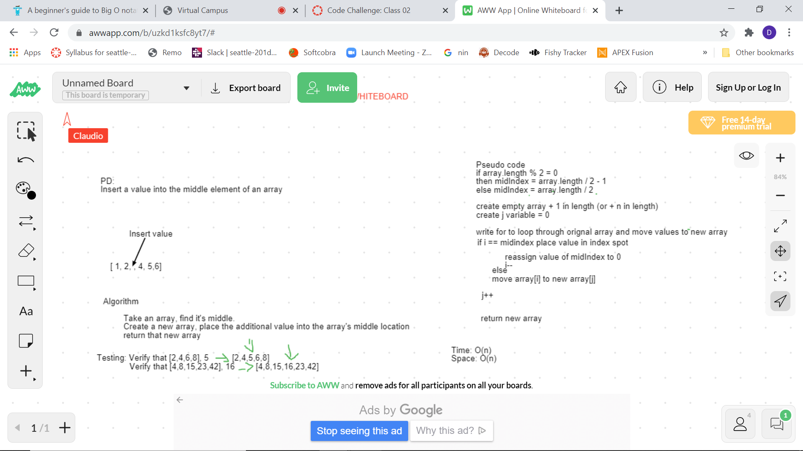

# Table of Content

[Reverse an Array](#Reverse-an-Array)
[Array Shift](#Array-Shift)
[Binary Search](#Binary-Search)

# Reverse an Array
This is a program that takes a array of integers and returns an array with the integers reversed (last index first ect).

### Challenge
The challenge is to move all values in one array to another in reverse order

### Approach & Efficiency
I create a new int array that is the same length as the one being passed in. Then use a for loop where i starts at array length and decrements i each pass through. On each pass through place value into new array then increment variable used to step through new array.

_________________________________________________________________________________

# Array Shift
This program will take an array and a value and insert the value into the middle of the array.

### Challenge
The challenge is to find the middle of the array and insert a value then continue to copy the original array with out loosing any values.

### Aproach & Efficiency
Space: O(n)
Time:  O(n)
Create a new array that is + 1 in length from original Array. Find middle index of original array and save in a variable. Have two variable for stepping through arrays. write a if statement to catch when the middle index is reached and insert value.

### Whiteboard

___________________________________________________________________________________

# Binary Search
This program will take a sorted int array and an integer and search through the array for the integer and return the index of where integer is located or -1 if integer is not found.

### Challenge
The challenge was that this needed to be done in binary search format.

### Aproach & Efficiency
Space: O(1)
Time:  O(1)
Save the first index (0) and the last index (array.length -1) in variables
add first + last / 2 to find middle
check if middle matches search integer and return index
if it doesn't match find new mid point depending on if it is greater then or less then mid point
repeat till found ? return -1 if not found

### Whiteboard
[whiteboard](whiteboards/binarySearch.png )

_________________________________________________________________________________

# Linked List
This library will create a linked list of int's. It will have the ability to add a new node to the head and will also have a toString method

### Challenge
Need to be able to insert a new node and be able to traverse through the linked list for the toString method and to be able to search the list for a value

#### Aproach & Efficiency
Space: O(n)
Time: O(n)
Make a Node constructor and a Linked List constructor
create a linked list with a tail and head node both set to null 
When adding to list if head isn't empty store current head in a temp var create new head node and move old head to the .next of new head

