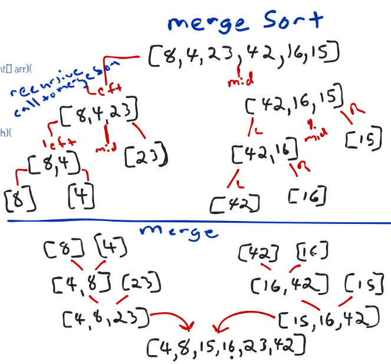

# Merge Sort

Merge Sort is a sorting algorithm that takes in an unsorted array of integers and splits it in half 
into two new arrays. It continues to do this recursivly until the array has been split into many 
arrays holding only one integer.
It then begins pass the pieces into a helper method that starts merging them back together putting
the smaller values to the left of a return array. It does this until all pieces have been merged 
back into the return array leaving a sorted array.

BigO time for merge sort is O(n*Log n) because it divide the array into halves and sorting happens 
as the halves are brought back together.

BigO space for merge sort is O(n) because no matter how many arrays you end up splitting the original
array into you will still have the same amount of index values as the original array.

